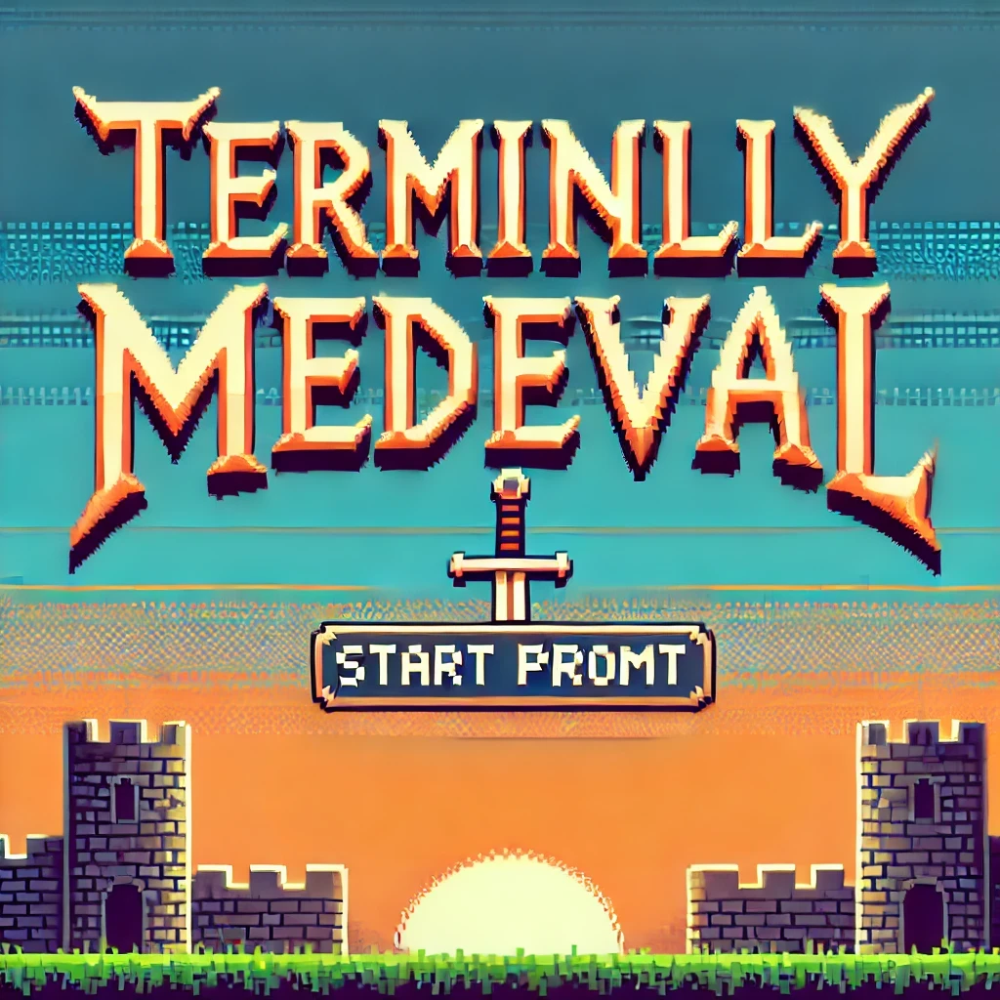

#  Terminlly-Medeval

#### This game was created by Blake Peters, Kayla Bristol and Abdullah Durrani

#### Acknowledgments

This markdown page benifitted from syntax guidance [ChatGPT](https://chat.openai.com) by OpenAI.
 
 
 

 ###  The Name of the Game  
 
 
 
 The goal of this game is to navigate through various choices and scenarios to gather loot, interact with characters, and survive adventures without dying. Each decision affects the story's progression and outcome.

 

 ###  It Begins

#### The player enters a name and selects a species—'Human', 'Elf', or 'Dwarf'. 

    function game() {
    let species, loot = 0, decision;
    // Prompts user for name
    const username = prompt('What is your name? ');
    console.log(`Hello ${username}`);

    // Prompts user for class choice that will also be used in future  
    console.log('Pick a species: Dwarf, Elf, or Human: ');
    console.log("1: Dwarf");
    console.log("2: Elf");
    console.log("3: Human");

    // Player chooses species
    decision = chooseFunc();
    if (decision === "1"){
        species = "Dwarf"
    } else if (decision === "2"){
        species = "Elf"    
    } else {
        species = "Human"
    }
  

 

#### note: the game uses 'if else' statements to vary experiences based on species choice.

 

 ###  FIRST SEQUENCE

### Event Summary: You're traveling down a path and you encounter a traveler.

#### You're given choices to either ignore, help or engage in conclict with a traveler.  
#### There is fucntionality in the code for different outcomes depending upon the the players choice of race.

Show/ Hide Code

    // Kayla's event
    console.log("As you are meandering down your path, you encounter a traveler.");
    console.log("1: Ignore.");
    console.log("2: Help.");
    console.log("3: Fight!");
    
    decision = chooseFunc();
    // Player ignores traveler
    if (decision === "1"){
        console.log("Ignore them. You are very shy after all… best not to make eye contact.");
        // In first choice if species is dwarf 
        if (species === "Dwarf"){
            console.log("You and the traveler give each other an up-nod as you pass. Nice.");
        } else if (species === "Elf"){
            console.log("You glide past the traveller without being seen. Great work!");
        } else {
            console.log("The traveller waves at you as you pass. You want to be friendly, so you wave back.",
                    "But as it turns out, there was another passerby behind you… the traveller was waving to them.",
                    "You pretend nothing happened. Carry on with your meandering.");
        }

    // Player helps traveler. If Dwarf or Elf = loot
    } else if (decision === "2"){
        console.log("Ask the traveler if they need help. It would be nice to have a companion if things go well.");
        if (species === "Dwarf"){
            console.log("Hello friend, how are your travels? Need any help?” You say. “Well yes actually I was looking",
                    "for a companion to help me find the nearest village. In fact, I`ll pay you! I`m very desperate.",
                    "Take these 20 coins.” They give you 20 coins and you move along to the nearest village together.");
            // Player gains 1 loot
            loot++;
        } else if (species === "Elf"){
            console.log("Hello friend, how are your travels? Need any help?” You say. “Well yes actually I was looking",
                    "for a companion to help me find the nearest village. I`m also over encumbered, so if you would, take" ,
                    "my extra sword and shield. They`re too much for me to carry.” They give you a sword and shield and you",
                    "move along to the nearest village together.");
            loot++;
        } else {
            console.log("You call out to the traveller. “Hello friend, I was just passing by and wondered —“ They glare",
                    "at you and interrupts, “A human eh? I`ll keep my distance, thank you. Move along before I change my",
                    "mind about killing you on the spot.” Oh my, a speciesist. You best avoid. Hurry along before",
                    "something bad happens.");
        }

    // Player fights traveler. If Elf or Human = loot, if Dwarf = die
    } else {
        console.log("Fight them! You could use some extra loot.");
        if (species === "Elf" || species === "Human"){
            console.log("You leap in front of the traveler and brandish your weapon. “Fight me you bastard!” You yell.",
                    "After some excellent swordsmanship, you defeat them! Great work. You earned some loot.");
            loot++;
        } else {
            console.log("You leap in front of the traveler and brandish your weapon. “Fight me you bastard!”",
                    "You yell. They leap back at you with their weapon. It`s a struggle, and the two of you are unevenly",
                    "matched! You`re too short! The traveler sees an opening in your armor and slashes at it. It is",
                    "a deep wound. You fall back, dazed! They have bested you! The traveler laughs and walks off. You see",
                    "a bright light… it`s all over.");
            // Player dies
            return false
        }
    }

 

 

 ###  SECOND SEQUENCE

### Event Summary: You're given an oppurtunity to participate in a raiding party or not.

####  Player is prompted to join a raiding party or to pass on the raid. Two of the choices will lead to loot and one choice will lead to death.
#### There is functionality in the code for different outcome based on choices made by the player during the interaction.

Show/ Hide Code

    // Abdullah's event
    console.log(`Thundering hooves signal approach; a sharp cry warns, "Bandits!"`,
        `You’ve got a choice, lad, and listen up closely, because I like repeating myself. Do you join these here bandits and increase your chances of loot or would you rather play it safe?;`)
    console.log("1: Get out my way, choice giver, I’m taking this loot while I can!");
    console.log("2: I am carrying enough weight, I don’t need this on my conscience, I am going to move on.");
    console.log("3: ‘I am going to wait it out here and see what happens.’");
    
    decision = chooseFunc();
    //Player joins bandits. If Dwarf = specific dialogue. All = loot      
    if (decision === "1"){
        console.log("You're natural, kid! Ever thought of running for office?");
        if (species === "Dwarf"){
            console.log("'Fiery little guy, ain't he?'");
        }
        loot++;

    //Player avoids bandits. If Elf = specific dialogue. All = loot    
    } else if (decision === "2"){
        if (species === "Elf"){
            console.log(`I am going to wait it out here and see what happens.`);
        }
        loot++;

    //Player does nothing. If Human = specific dialogue. All = die.    
    } else {
        if (species === "Human"){
        console.log(`Nothing good can come of waiting’ ya gotta go out and take it!`);
        }
        console.log(`Caught between advancing forces and escaping raiders, you are killed in the collision.`)
        return false
    }

 

###  THIRD SEQUENCE 

### Event Summary: After walking along your path you realize that you have enetred 'The Woods of Darkness'

#### You can either turn around, travel north or south. Two of the decisions lead to loot one does not.

Show/ Hide Code

    // Kayla's 2nd event
    console.log("As you walk along, the woods around you become thicker and thicker. The sky darkens... it appears",
        "you have entered the Woods of Darkness.");
    console.log("1: Turn around.");
    console.log("2: Go to southern part of woods.");
    console.log("3: Go to northern part of woods.");
    
    decision = chooseFunc();
    //Player turns around
    if (decision === "1"){
        console.log("'Fuck that.' You say. You decide to turn around and not risk it.");
        if (species === "Dwarf" || species === "Elf" || species === "Human"){
            console.log("You hurry back to the main path.");
        }

    //Player goes south. All = loot
    } else if (decision === "2"){
        console.log("You decide to head south further into the woods.");
        if (species === "Dwarf" || species === "Human"){
            console.log("As you walk along, you come across a pile of disturbed soil. You brush away some of",
                    "the dirt to reveal a pile of poorly hidden gold! Nice.");
            loot++;
        } else {
            console.log("As you walk along, you come across a rusted old chest! You open it to find a glowing",
                    "pair of boots. They look powerful. Nice loot acquiring!");
            loot++;
        }

    //Player goes north. All = loot
    } else {
        console.log("You decide to head north further into the woods.");
        if (species === "Dwarf" || species === "Elf"){
            console.log("As you walk along, you find a hole in the ground. There's a bunch of gold in it.");
            loot++;
        } else {
            console.log("As you walk along, you see a tree with what looks like a face... suddenly, the tree",
                "springs to life and says, 'Lucky traveler! You have run into me, the Tree of Abundance. Take",
                "this loot as a little treat.'");
            loot++;
            }
    }

 

###  FORTH SEQUENCE 

### Event Summary: Player is presented with a wild Snorlax appearing in their path blocking the entrance to the mystical shop. 
### You can either poke the Snorlax, tell a funny joke or squeeze past him.
#### There is fucntionality in the code for different outcomes depending upon the the players choice of race. 

Show/ Hide Code

    // Blake's event
    console.log("A wild snorlax appears on your adventure, blocking the entrance path to the mystical shop.");
    console.log("1: Poke him with your weapon.");
    console.log("2: Tell him a funny joke.");
    console.log("3: Squeeze past him!");

    decision = chooseFunc();
    // Pokes snorlax. If dwarf = die.
    if (decision === "1"){
        if (species === "Dwarf") {
            console.log(" pokes him with his mighty sword but all the snorlax sees is a tiny dude",
                "with a toothpick stabbing him and rolls on top of you going back to sleep.");
            return false;
        } else {
            console.log("You stab the snorlax and it immediately wakes up and moves out of the way, allowing you to proceed.");
        }
    } 
    // Tells funny joke. All = loot.
    else if (decision === "2") {
        if (species === "Dwarf") {
            console.log("Hey Snorlax! You can always rely on a dwarf, we'll never look down on you.");
        } 
        else if (species === "Elf") {
            console.log("3 elves walk in a bar. One starts to hug the wooden interior", 
                "one stands high up on the bar and the last one stands in the darkest corner and glares...", 
                "The other guests look at them and then at the dwarven Barkeeper and ask:'You not gonna stop them?'", 
                "The Barkeeper just shrugs and says:'Nah, don't bother.'",
                "If they leave they might come back and bring a blood elf and no one wants to see THAT!");
        }
        else {
            console.log("A high elf, a wood elf, and a dark elf walked into a bar, BANG! A dwarf walks under it.");
        }
        console.log("Snorlax jolts up laughing and hands you a gold rock as tip for that wonderful joke.");
        loot++;
    } 
    // Squeezes past snorlax. If elf or human = die.
    else {
        if (species === "Dwarf") {
            console.log("As a dwarf, you narrowly slip past the snorlax when they exhale, successfully making it to the shop.");
        } 
        else {
            console.log("You try to push yourself past the snorlax but then it suddenly",
              "inhales for a massive yawn squishing you between the rock and its massive belly.");
              return false;
        }
    }

 

###  FIFTH, FINAL SEQUENCE 

### Event Summary: Player has made it to the end of the game. Player can decide how to spend the loot they've accumulated.
### Choices vary depending upon total loot. You can either take  a free handout, purchase a myster item or handover all loot to shopkeeper.

Show/ Hide Code

    
    // Blake's final event
    console.log("You enter the mystical shop. The hooded snakeshaped shop keeper asks, 'What do you want to purchase?");
    console.log(`You have ${loot} tradable loot items.`);
    console.log("1: Take the free handout. (0 loot price)");
    console.log("2: Purchase a mystery item. (2 loot price)");
    console.log("3: Hand over all 4 adventure loot items to shop keeper.");

    // Original chooseFunc function modified to handle loot
    let finalChoice = false

    while (!finalChoice) {
        // Original chooseFun code
        decision = chooseFunc();

        // If the user doesnt have enough money, run loop until they choose a viable option
        if ((decision === "2" && loot < 2) || (decision === "3" && loot < 4)) {
            console.log(`You do not have enough loot to select this option. You have ${loot} loot item(s).`);
        }
        // User decides a viable choice
        else {
            finalChoice = true;
        }
    }

    // Final decision - User lives but has different endings depending on final choice
    if (decision === "1"){
        console.log("You pick up a binding slave contract. You are now a slave to capitalism and are forced to work for the shop owner for the rest of your life.");
    } 
    else if (decision === "2") {
        console.log("You open a mystery box that contains an SSS rank item! You are now an SSS rank adventurer and can take on any challenge in your future!");
    } 
    else {
        console.log("You buy the whole shop and become the shopkeeper, the final boss of this adventure.", 
            "Your final act is to raise the loot prices for any future wanderers to meet a pitiful end.");   
    }
    return true;
}
    

 

###  ADDTIONAL FUNCTIONALITY

### There is added functionality in game to prompt player if they do not accept the available prompts during choice scenarios.

Show/ Hide Code

    // function to handle repeated code of choosing options 1-3 and repeating instruction if user types something else
    function chooseFunc() {
    let choice = prompt('Make your choice. 1,2, or 3: ');

    while (choice !== "1" && choice !== "2" && choice !== "3") {
    console.log("That is not an option.");
    choice = prompt('Make your choice. 1,2, or 3: ');
    }
    return choice;
    }

 

